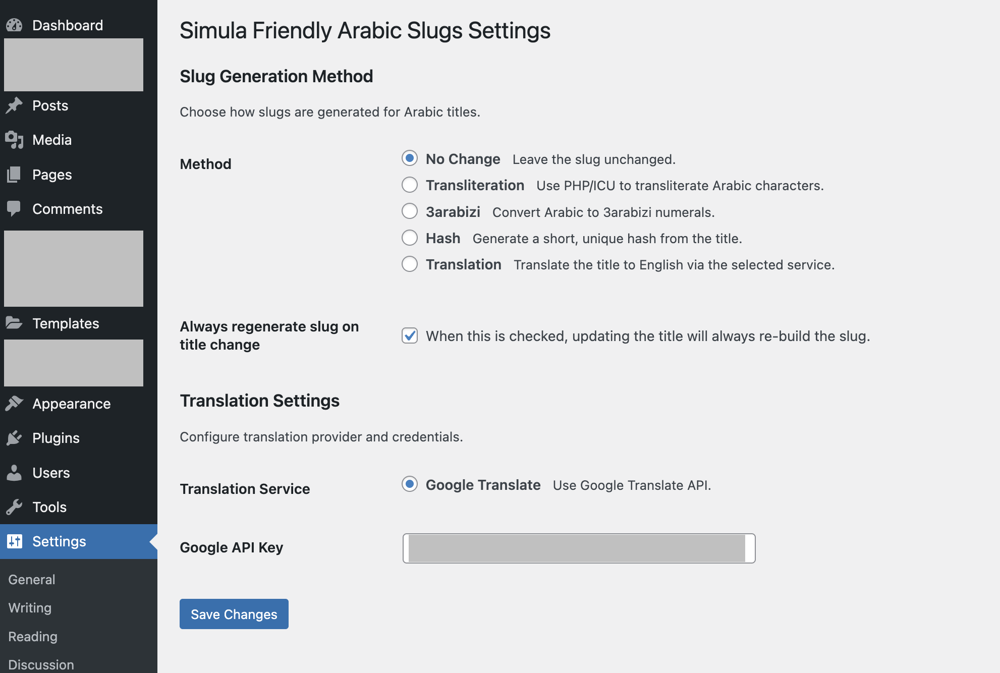
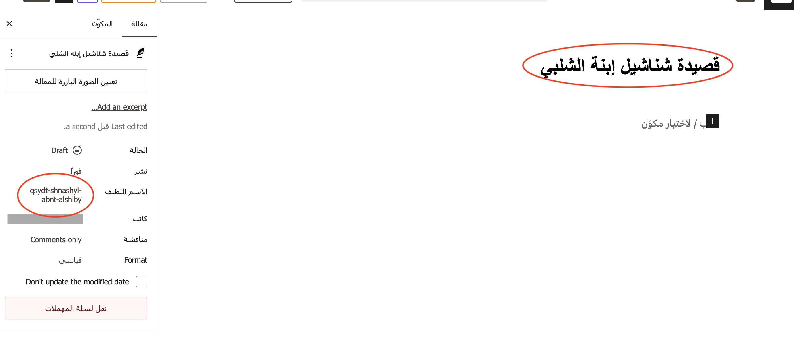
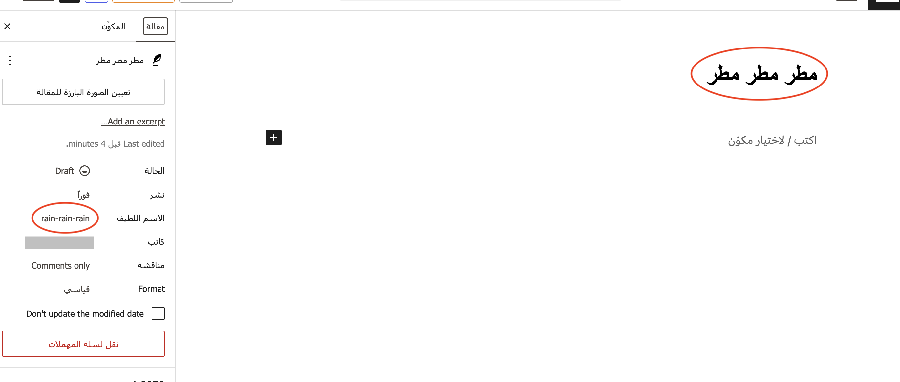

# Simula Friendly Slugs for Arabic Sites


## Overview

A WordPress plugin developed by [Simula Lab Ltd](https://simulalab.org) that helps editors to automatically generate URL-friendly slugs for Arabic content by transliteration, “3arabizi,” machine translation, or leave unchanged—perfect for social media sharing and SEO.
The plugin is also available to download from the official wordpress plugins directory here: https://wordpress.org/plugins/simula-friendly-slugs-for-arabic-sites

## Features

- Automatic Slug Replacement:
  On save or publish, your Arabic post/page slug is replaced (or left intact) according to your chosen method:
  - Transliteration (e.g. `مرحبا` → `marhba`)
  - 3arabizi (e.g. `مرحبا` → `mr7ba`)
  - Machine Translation (via Google Translate; e.g. `مرحبا` → `hello`)
  - No Change (e.g. `مرحبا` → `مرحبا`)

- Settings UI
  - Intuitive admin page under **Settings → Friendly Slugs**  
  - Select default method, API keys, and per-post override.

- Per-Post Control
  - Meta box on the edit screen to override the global slug method.

## Installation

Login as an admin, navigate to "Plugins" then click the "Add new plugin" button.\
Search for the plugin name in the search bar, as it is available in the wordpress.org public plugins directory then when you find it click on "Install Now".

or...

Download the plugin folder, compress the folder to a `.zip` file.\
Login as an admin, navigate to "Plugins" then click the "Add new plugin" button.\
Then click on "Upload Plugin", and upload the zip file, then click "Install Now"

Activate the plugin upon successful installation.

## Usage

WIP








## Reporting bugs

Please create an issue for the bug, and try to be thourough. 
If possible include screenshots, and other important details such as WordPress version, PHP version, etc.

## Contributing
Contributions are welcome!

When creating a pull request make sure to use the following template:

```
Change Summary
 - item one
 - item two
Related issue number
 - issue a
 - issue b
Checklist
  [ ] code is ready
  [ ] add tests
  [ ] all tests passing
  [ ] test coverage did not drop
  [ ] PR is ready for review
```

## Upgrade on Wordpress.org Directory

- update the plugin code
- test your changes 
- update version number in readme.txt and meta data
- git commit changes to this repository
- use svn to checkout the SVN repository
- add changes to /trunk/ and to /tags/{{major.minor.patch}}/
- svn commit changes to plugins directory

## License
The plugin was developed under the GPL-2.0 license: http://www.gnu.org/licenses/gpl-2.0.html.
